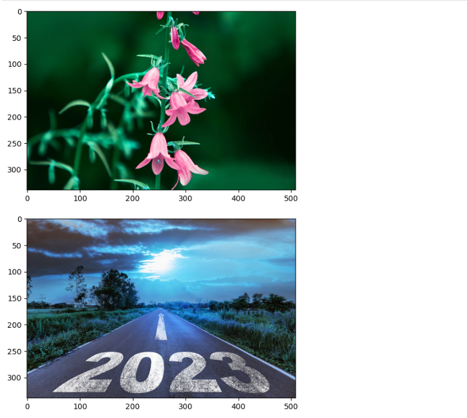

# Histogram and Histogram Equalization of an image
## Aim
To obtain a histogram for finding the frequency of pixels in an Image with pixel values ranging from 0 to 255. Also write the code using OpenCV to perform histogram equalization.

## Software Required:
Anaconda - Python 3.7

## Algorithm:
## Step 1:
Import cv2, matplotlib.py libraries and display the saved images using cv2.imshow().

## Step 2:
Use cv2.calcHist(images, channels, mask, histSize, ranges[, hist[, accumulate]]) to find the histogram of the image.

## Step 3:
Plot the image and its stem plots using the plt.show() and plt.stem() functions.

## Step 4:
Equalize the grayscale image using the in-built function cv2.equalizeHist().

## Step 5:
Print the original and equalized image using cv2.imshow() and end the program.


# Program:

# Developed By:R.Brindha
# Register Number:212222230023
import cv2
import matplotlib.pyplot as plt

# Write your code to find the histogram of gray scale image and color image channels.

```python
import cv2
import matplotlib.pyplot as plt
Gray_image=cv2.imread('purple.jpg')
plt.imshow(Gray_image)
plt.show()
Color_image=cv2.imread('ye.jpg')
plt.imshow(Color_image)
plt.show()

```


# Display the histogram of gray scale image and any one channel histogram from color image

```python
import cv2
import matplotlib.pyplot as plt
gray_image = cv2.imread("purple.jpg")
clr_image = cv2.imread("ye.jpg",-1)
gray_hist = cv2.calcHist([gray_image],[0],None,[256],[0,256])
clr_hist = cv2.calcHist([clr_image],[0],None,[256],[0,256])
plt.figure()
plt.imshow(gray_image)
plt.show()
plt.title("Histogram")
plt.xlabel("Grayscale Value")
plt.ylabel("Pixel Count")
plt.stem(gray_hist)
plt.show()
plt.imshow(clr_image)
plt.show()
plt.title("Histogram of Color Image - Green Channel")
plt.xlabel("Intensity Value")
plt.ylabel("Pixel Count")
plt.stem(clr_hist)
plt.show()

```

# Write the code to perform histogram equalization of the image. 

```python
import cv2
import matplotlib.pyplot as plt 
gi=cv2.imread("purple.jpg",0)
colorscale=cv2.imread("ye.jpg")
g=cv2.resize(gi,(500,400))
equ=cv2.equalizeHist(gi)
cv2.imshow("Grey Scale",g)
cv2.imshow("Equalization",equ)
cv2.waitKey(0)
cv2.destroyAllWindows()

```
## Output:
### Input Grayscale Image and Color Image


### Histogram of Grayscale Image and any channel of Color Image


### Histogram Equalization of Grayscale Image


## Result: 
Thus the histogram for finding the frequency of pixels in an image with pixel values ranging from 0 to 255 is obtained. Also,histogram equalization is done for the gray scale image using OpenCV.
